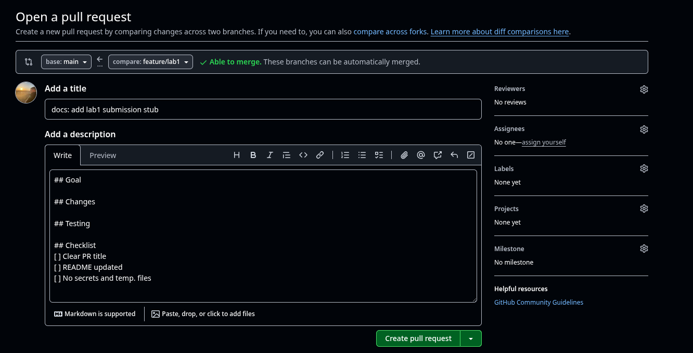
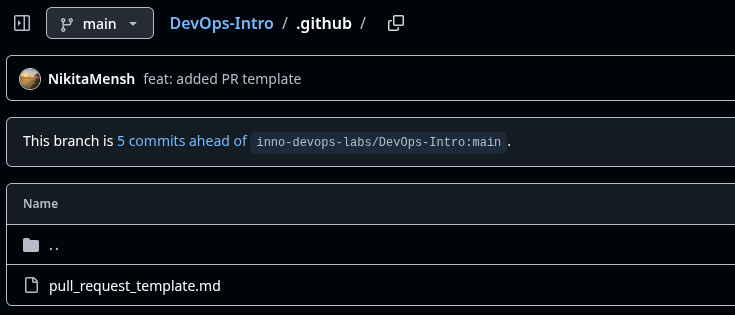

# Lab 1 — SSH Commit Signing

## Benefits of Signing Commits

Signing commits ensures that the commits come from a trusted source and that the content of the commit hasn't been tampered with. This is important in a collaborative environment where multiple developers are working on the same codebase.

## Evidence of Successful SSH Key Setup and Signed Commit

### SSH Key Setup

  

  

## Why is Commit Signing Important in DevOps Workflows?

In DevOps, where automation and continuous integration are key, it is crucial to maintain trust in the code being deployed. By using signed commits, teams can avoid malicious code and ensure that the history of changes is traceable and reliable.

## Screenshot of PR Template Auto-Filling the Description

## Evidence that `.github/pull_request_template.md` Exists on Main Branch

## Analysis of How PR Templates Improve Collaboration

PR templates provide a standardized format for pull request descriptions, ensuring that each PR includes essential details such as the goal, changes, testing, and a checklist. This consistency improves communication within teams, making it easier for reviewers to understand the purpose of the changes, test them, and verify the work.