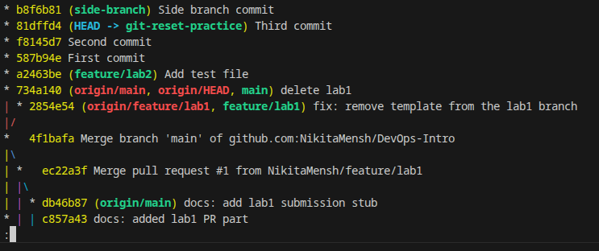

# Lab 2 — Version Control & Advanced Git

---

# Task 1 — Git Object Model Exploration

## 1.1 Get Commit Hash

```bash
$ git log --oneline -1
a2463be (HEAD -> feature/lab2) Add test file
```

## 1.2 Inspect Commit Object

```bash
$ git cat-file -p a2463be
tree ae3ac39a96157ad268050315c7c8987dd30bd62b
parent 734a14062c8aae22d83ea0bc1c6ab848f9a9323a
author Nikita Menshikov <mensikovnikita167@gmail.com> 1770811818 +0300
committer Nikita Menshikov <mensikovnikita167@gmail.com> 1770811818 +0300
gpgsig -----BEGIN SSH SIGNATURE-----
 U1NIU0lHAAAAAQAAADMAAAALc3NoLWVkMjU1MTkAAAAgm0pZaa2gthB+CWUihta4tgzi8m
 ffhSrCnR1LNrGRAJYAAAADZ2l0AAAAAAAAAAZzaGE1MTIAAABTAAAAC3NzaC1lZDI1NTE5
 AAAAQPkHPG3u1vjDMW/1cjIXf6sejj+iMAdvIhOiATX8ME0oFXQOiEHNaqqFkr2tn3MP6K
 EV14zrUIgN1Jo+B59I5wg=
 -----END SSH SIGNATURE-----

Add test file
```

## Inspect Tree Object

```bash
$ git cat-file -p ae3ac39a96157ad268050315c7c8987dd30bd62b
040000 tree 75d7cfc34f6679fea88df5a1fd3b8fcb3bac8ad4    .github
100644 blob 6e60bebec0724892a7c82c52183d0a7b467cb6bb    README.md
040000 tree a1061247fd38ef2a568735939f86af7b1000f83c    app
040000 tree 3caaf68ae7cfd329ffd3007b6159e2cb9962af8b    labs
040000 tree d3fb3722b7a867a83efde73c57c49b5ab3e62c63    lectures
```

## Inspect Directory Structure

```bash
$ git ls-tree ae3ac39a96157ad268050315c7c8987dd30bd62b
100644 blob aa6b7b5c478b439d2c1e9b4f085257782dd68d25    lab1.md
100644 blob cf1ba99be683932b0a1e1cfd84f0d6f0dc0d184f    lab10.md
100644 blob ca6bbf33cb79a950fbf3c517e6b174ac65f5334b    lab11.md
040000 tree 16bf9eb348f7da4acbec0a94fc4a09e46c40064f    lab11
100644 blob fcd2509fd7a30ea3b5cc9e879f97fbb32d3e660d    lab12.md
040000 tree 129069dd8e40511c9ab6c889b375532b1d68fde3    lab12
100644 blob 3128f48b832e6592d02ae82a18f9b89af82c9658    lab2.md
100644 blob 6e453f5c97f02a4bca77db29549154072771ad4a    lab3.md
100644 blob 3aa4439565d04ff637e909ffc164d59a60749239    lab4.md
100644 blob 0435c3fcbd5d21b21cf253af0544a6536247cdb9    lab5.md
100644 blob af90a7fa02f582cd3d31f4d9f71360878f031e92    lab6.md
100644 blob ee11bdfb0d71048268ec439ad0c4ee2f7bf6fd1b    lab7.md
100644 blob 9df09119213b81f88f6b61c89f3bcf223a32ecf6    lab8.md
100644 blob 12e1b875e40d5ef91f11c36fb259f23069fc458f    lab9.md
100644 blob 2eec599a1130d2ff231309bb776d1989b97c6ab2    test.txt
```

### What each object type represents

* **Blob:** raw file contents (no filename, no path). 
* **Tree:** a directory listing: filenames + modes + pointers to blobs/trees. 
* **Commit:** metadata (author/committer, message, parents) + pointer to the root tree (snapshot). 

### Analysis: how Git stores repository data

Git is a content-addressed database: each object is stored by hash; commits reference trees; trees reference blobs/trees; this forms a DAG of snapshots and history. 

### Example of blob/tree/commit content (from your outputs)

* **Commit content:** shows `tree ...`, `parent ...`, author/committer, signature, message. 
* **Tree content:** shows entries like `.github`, `README.md`, `labs` with modes and object IDs. 
* **Blob content:** a blob is referenced in the tree listing (e.g., `README.md` blob id). 

---

# Task 2 — Reset and Reflog Recovery

## Initial History

```bash
$ git log --oneline
81dffd4 (HEAD -> git-reset-practice) Third commit
f8145d7 Second commit
587b94e First commit
...
```

## Soft Reset

```bash
$ git reset --soft HEAD~1
$ git log --oneline
f8145d7 (HEAD -> git-reset-practice) Second commit
587b94e First commit
...
```

**Effect:** HEAD moved; index and working tree preserved.

## Hard Reset

```bash
$ git reset --hard HEAD~1
HEAD is now at 587b94e First commit
```

```bash
$ git log --oneline
587b94e (HEAD -> git-reset-practice) First commit
...
```

**Effect:** HEAD moved; index and working directory reset.

## Reflog

```bash
$ git reflog
587b94e (HEAD -> git-reset-practice) HEAD@{0}: reset: moving to HEAD~1
f8145d7 HEAD@{1}: reset: moving to HEAD~1
81dffd4 HEAD@{2}: commit: Third commit
f8145d7 HEAD@{3}: commit: Second commit
587b94e (HEAD -> git-reset-practice) HEAD@{4}: commit: First commit
a2463be (feature/lab2) HEAD@{5}: checkout: moving from feature/lab2 to git-reset-practice
...
```

## Recovery

```bash
$ git reset --hard 81dffd4
HEAD is now at 81dffd4 Third commit
```

```bash
$ git log --oneline
81dffd4 (HEAD -> git-reset-practice) Third commit
f8145d7 Second commit
587b94e First commit
...
```

### Exact commands you ran and why

* `git reset --soft HEAD~1` — move HEAD back one commit but keep changes staged. 
* `git reset --hard HEAD~1` — move HEAD back one commit and discard index + working tree changes. 
* `git reflog` — find previous HEAD states to recover “lost” commits. 
* `git reset --hard 81dffd4` — restore the branch to the reflog commit (recover state). 

### What changed (working tree / index / history)

* **`--soft`**: history moved (HEAD changes), **index kept**, **working tree kept** (changes remain staged). 
* **`--hard`**: history moved, **index reset**, **working tree reset** (changes discarded). 

### Analysis of recovery using reflog

Even after `--hard`, reflog retains pointers to prior HEAD positions, so you can reset back to a previous commit hash to restore the state.

---

# Task 3 — History Visualization

Using:

```bash
$ git log --oneline --graph --all
```

The image of the graph:


### Reflection: how the graph aids understanding (1–2 sentences)

`git log --graph --all` makes branch divergence/merge structure visible, so it’s easier to see where work happened and how branches relate without manually tracking commit hashes. 

---

# Task 4 — Tagging Commits

## Tag v1.0.0

```bash
$ git tag v1.0.0
$ git push origin v1.0.0
Total 0 (delta 0), reused 0 (delta 0), pack-reused 0
To github.com:NikitaMensh/DevOps-Intro.git
 * [new tag]         v1.0.0 -> v1.0.0
```

## Log After Tagging

```bash
$ git log --oneline
81dffd4 (HEAD -> git-reset-practice, tag: v1.0.0, origin/git-reset-practice) Third commit
f8145d7 Second commit
587b94e First commit
a2463be (origin/feature/lab2, feature/lab2) Add test file
...
```

## Tag v1.1.0

```bash
$ git tag v1.1.0
$ git push origin v1.1.0
Total 0 (delta 0), reused 0 (delta 0), pack-reused 0
To github.com:NikitaMensh/DevOps-Intro.git
 * [new tag]         v1.1.0 -> v1.1.0
```

### Tag names and commands used

* `v1.0.0`: `git tag v1.0.0`, `git push origin v1.0.0` 
* `v1.1.0`: `git tag v1.1.0`, `git push origin v1.1.0` 

### Associated commit hashes

* `v1.0.0` points to `81dffd4` (shown in `git log --oneline`). 
* `v1.1.0` points to `b8f6b81` (shown in `git log --oneline`). 

### Why tags matter

Tags are stable names for specific commits (releases). They simplify versioning, release notes, and can be used by CI/CD to trigger release pipelines. 

---

# Task 5 — git switch vs checkout vs restore

## Working With restore

```bash
$ echo "scratch" >> demo.txt
$ git status
On branch cmd-compare-2
Untracked files:
        demo.txt
        image.png
        submission2.md

nothing added to commit but untracked files present
```

Attempt to restore untracked file:

```bash
$ git restore demo.txt
error: pathspec 'demo.txt' did not match any file(s) known to git
```

Stage file:

```bash
$ git add demo.txt
$ git restore demo.txt
$ git status
On branch cmd-compare-2
Changes to be committed:
        new file:   demo.txt
```

Unstage:

```bash
$ git restore --staged demo.txt
$ git status
On branch cmd-compare-2
Untracked files:
        demo.txt
        image.png
        submission2.md
```

Commit:

```bash
$ git commit -m 'Demo file'
[cmd-compare-2 55a57bc] Demo file
 1 file changed, 1 insertion(+)
 create mode 100644 labs/demo.txt
```

Restore from previous commit:

```bash
$ git restore --source=HEAD~1 demo.txt
$ git status
On branch cmd-compare-2
Changes not staged for commit:
        deleted:    demo.txt
```

### Commands you ran and outputs / state changes

Your sequence shows:

* `git restore` failing on an untracked file (not known to Git yet),
* staging/unstaging with `git restore --staged`,
* restoring from an older source with `--source=HEAD~1`. 

### 2–3 sentences: when to use `switch`, `checkout`, `restore`

* Use **`git switch`** for branch creation/switching (clear intent: branches only). 
* Use **`git restore`** to discard or recover file changes (working tree and/or index), including restoring from another commit with `--source`.
* Use **`git checkout`** mainly for legacy workflows; it overloads branch + file operations and is easier to misuse. 

---
# Task 6

### Why starring repositories matters (1–2 sentences)

Stars act as a lightweight signal of interest/quality and help discovery (bookmarking + visibility), which can attract contributors and increase project reach. 

### How following developers helps (1–2 sentences)

Following improves awareness of teammates’ and maintainers’ activity, helps discover relevant repos/solutions, and supports collaboration by keeping you connected to people working in the same area. 
