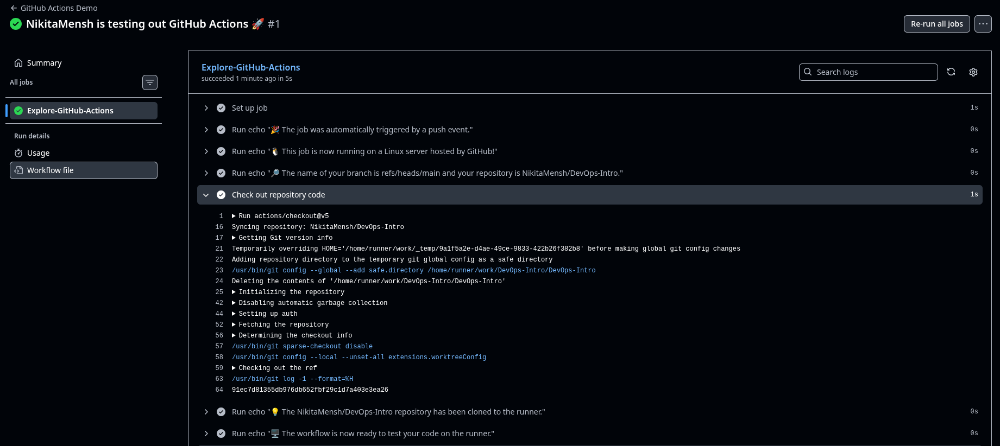
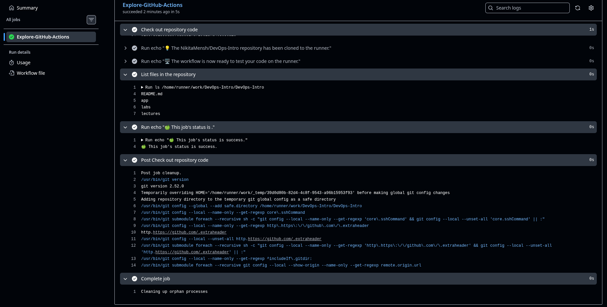
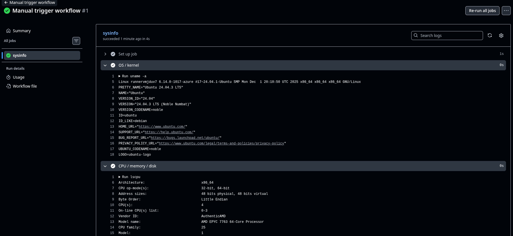
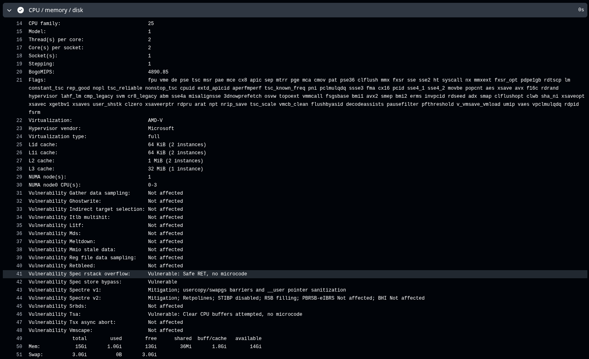
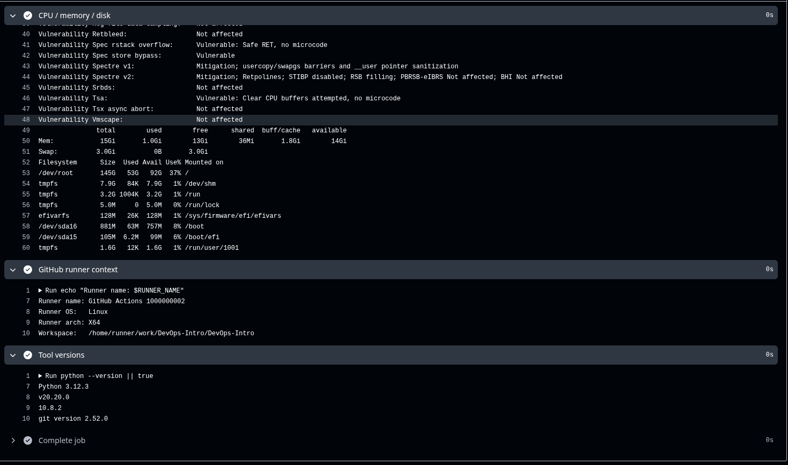

# Lab 3 — CI/CD with GitHub Actions

Platform: **GitHub Actions**

---

# Task 1 — First GitHub Actions Workflow

## 1.1 Implementation of Quickstart

I followed the official GitHub Actions Quickstart guide and created a workflow file inside:

```
.github/workflows/
````

The workflow:

- Runs on `push`
- Uses `ubuntu-latest` runner
- Contains one job
- Executes multiple steps using `run:`

### Key Concepts Learned

- **Workflow** — defined in YAML file inside `.github/workflows/`
- **Event Trigger** — `on: push`
- **Job** — a collection of steps executed on a runner
- **Steps** — individual commands or actions
- **Runner** — virtual machine provided by GitHub
- **Actions** — reusable components like `actions/checkout`

---

## 1.2 Push Trigger Test

After pushing a commit, the workflow was triggered automatically.

### Workflow Overview Screenshot



### Successful Run Details



### What Triggered the Run

The workflow was triggered by a **push event** to the repository branch.

### Execution Process Analysis

1. GitHub detected a push event.
2. A runner (Ubuntu Linux VM) was provisioned.
3. The repository was cloned.
4. Workflow steps were executed sequentially.
5. The job completed successfully.

This demonstrates automatic CI execution on repository changes.

---

# Task 2 — Manual Trigger + System Information

## 2.1 Added Manual Trigger

The workflow was extended with:

```yaml
on:
  push:
  workflow_dispatch:
````

`workflow_dispatch` enables manual execution from the GitHub UI.

---

## 2.2 Manual Dispatch Test

The workflow was manually triggered via:

Actions → Select workflow → **Run workflow**

The job executed successfully.

---

## 2.3 System Information Collection

Additional steps were added to collect runner system information:

* `uname -a`
* `lsb_release -a`
* `lscpu`
* `free -h`
* `df -h`
* Printing runner environment variables

---

## Runner OS Information



* OS: Ubuntu 24.04 LTS
* Kernel: Linux 6.14.x
* Architecture: x86_64

---

## CPU / Memory / Disk Information



Key details:

* CPU: AMD EPYC 7763
* 4 vCPUs
* 15 GiB RAM
* 3 GiB swap
* ~145 GB root disk

---

## Runner Context & Tool Versions



* Runner OS: Linux
* Architecture: X64
* Git version: 2.52.0
* Python: 3.12.3
* Node.js: 20.20.0

---

## Manual vs Automatic Trigger Comparison

| Feature           | Push Trigger           | Manual Trigger    |
| ----------------- | ---------------------- | ----------------- |
| Activation        | Automatic on commit    | Manual via UI     |
| Use Case          | Continuous Integration | Testing/debugging |
| Human Interaction | None                   | Required          |

Manual triggers are useful for debugging, re-running jobs, and testing without creating new commits.

---

## Runner Environment Analysis

The runner environment is:

* Ephemeral (new VM per run)
* Pre-configured with development tools
* Hosted by GitHub
* Suitable for CI workloads
* Isolated and automatically cleaned after job completion

The system resources are sufficient for typical CI tasks such as testing, building, and linting.

---

# Conclusion

This lab demonstrated:

* Creating a GitHub Actions workflow
* Automatic execution on push
* Manual workflow dispatch
* Viewing logs and debugging
* Collecting detailed runner system information
* Understanding CI execution lifecycle

Both automatic and manual triggers were successfully tested, and system information was gathered and analyzed.